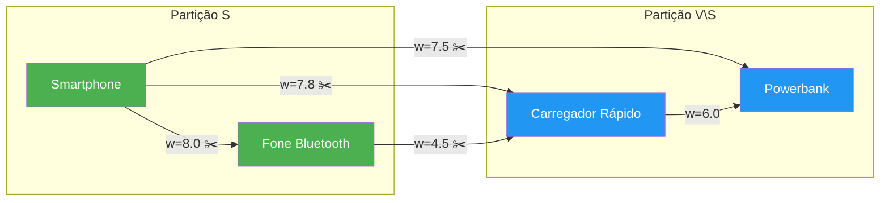
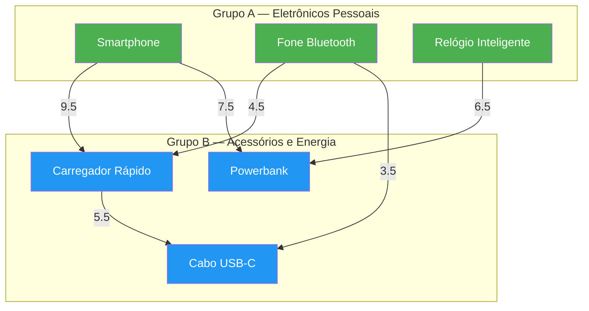
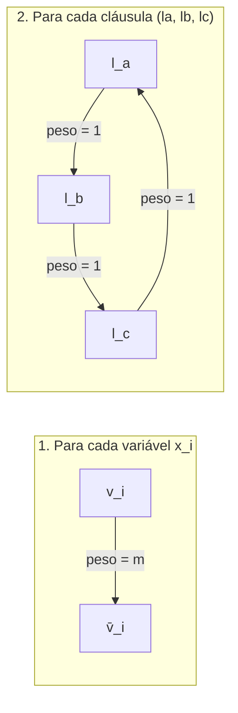

# Trabalho PAA — Corte Máximo (Max-Cut)

## Índice

1. [Descrição do problema](#descrição-do-problema)
2. [Modelagem para e-commerce](#modelagem-para-e-commerce)
3. [Prova de NP-Completude](#prova-de-np-completude)
4. [Regra de ponderação dos pesos](#regra-de-ponderação-dos-pesos)
5. [Estrutura do repositório](#estrutura-do-repositório)
6. [Formato da instância](#formato-da-instância-json)
7. [Algoritmos implementados](#algoritmos-implementados)
8. [Execução](#execução)
9. [Exemplo de saída](#exemplo-de-saída)

---

## Descrição do problema

O **Corte Máximo (Max-Cut)** é um problema clássico da teoria dos grafos:

> Dado um grafo ponderado $G = (V, E, w)$, encontrar uma partição dos vértices em dois conjuntos $(S,\; V \setminus S)$ que **maximize** a soma dos pesos das arestas que cruzam o corte.



As arestas marcadas com ✂️ cruzam o corte e seus pesos são somados.

---

## Modelagem para e-commerce

O problema é aplicado ao contexto de **relações de compra conjunta** em e-commerce:

| Conceito do grafo | Significado no e-commerce |
|---|---|
| Vértice | Produto (ex.: "Smartphone", "Fone Bluetooth") |
| Aresta | Relação de compra conjunta entre dois produtos |
| Peso da aresta | Força da relação — calculada pelo [índice de Jaccard](#regra-de-ponderação-dos-pesos) |
| Partição $(S, V \setminus S)$ | Divisão dos produtos em dois grupos |
| Peso do corte | Soma das relações **entre** os dois grupos |

**Objetivo prático:** identificar a divisão de produtos que maximiza as relações cruzadas — útil para estratégias de cross-selling, layout de loja e recomendações.



---

## Prova de NP-Completude

Para provar que Max-Cut é **NP-Completo**, precisamos de dois passos:

### Passo 1 — Max-Cut ∈ NP

Um problema está em NP se, dado um **certificado** (solução candidata), conseguimos **verificar** sua validade em **tempo polinomial**.

| Elemento | No Max-Cut |
|---|---|
| Certificado | Uma partição $(S, V \setminus S)$ |
| Verificação | Somar os pesos das arestas que cruzam o corte |
| Complexidade | $O(\|E\|)$ — percorre cada aresta uma única vez |

No código, a função `verify_cut` em `baseline.py` é o verificador:

```python
def verify_cut(instance, side_a, threshold):
    """Verifica em O(|E|) se o corte ≥ k."""
    weight = sum(
        rel.weight
        for rel in instance.relations
        if (rel.product_a in side_a) != (rel.product_b in side_a)
    )
    return weight >= threshold, weight
```

> **Conclusão:** como existe um verificador polinomial, **Max-Cut ∈ NP**. ✓

### Passo 2 — Max-Cut é NP-Difícil (redução de NAE-3SAT)

Precisamos reduzir um problema **sabidamente NP-Completo** ao Max-Cut em tempo polinomial. Usamos:

$$\text{NAE-3SAT} \leq_p \text{Max-Cut}$$

#### O que é NAE-3SAT?

**Not-All-Equal 3-SAT:** dada uma fórmula 3-CNF, existe uma atribuição tal que, em cada cláusula, os literais **não sejam todos iguais**?

#### Construção da redução

Dada uma instância NAE-3SAT com $n$ variáveis e $m$ cláusulas:



1. **Para cada variável** $x_i$: criar vértices $v_i$ e $\bar{v}_i$ conectados por aresta de peso $m$.
2. **Para cada cláusula** $(l_a, l_b, l_c)$: criar um triângulo entre os literais com arestas de peso 1.
3. **Limiar:** $k = n \cdot m + 2m$.

#### Por que funciona?

| Direção | Argumento |
|---|---|
| NAE-3SAT satisfeita → corte ≥ k | Colocar $x_i$ = true no lado $S$, $\neg x_i$ no outro. Cada aresta de variável contribui $m$, cada triângulo contribui exatamente 2. Total = $nm + 2m = k$. |
| Corte ≥ k → NAE-3SAT satisfeita | As arestas de peso $m$ forçam $v_i$ e $\bar{v}_i$ em lados opostos. Cada triângulo precisa contribuir 2 (máximo), logo os 3 literais não são todos iguais. |

A redução é polinomial: cria $O(n + m)$ vértices e $O(n + m)$ arestas.

### Conclusão da prova

$$\boxed{\text{Max-Cut} \in \text{NP} \;\;\wedge\;\; \text{NAE-3SAT} \leq_p \text{Max-Cut} \;\;\Longrightarrow\;\; \text{Max-Cut é NP-Completo}}$$

### Evidência empírica no código

O algoritmo de força bruta enumera $2^{n-1}$ partições — crescimento exponencial:

| Instância | \|V\| | \|E\| | Partições | Tempo (busca) | Tempo (verificação) | Speedup |
|---|---|---|---|---|---|---|
| `small_instance.json` | 15 | 61 | 16.384 | ~0,07s | ~0,000008s | ~9.600× |
| `medium_instance.json` | 22 | 46 | 2.097.152 | ~8,3s | ~0,000007s | ~1.258.000× |

> A busca cresce **exponencialmente** com $n$, enquanto a verificação permanece **constante** em $O(\|E\|)$.

---

## Regra de ponderação dos pesos

Os pesos das arestas são calculados pelo **índice de Jaccard**, que mede a similaridade de compra entre dois produtos:

$$\text{peso}(A, B) = \frac{\text{compras\_conjuntas}(A, B)}{\text{compras}(A) + \text{compras}(B) - \text{compras\_conjuntas}(A, B)} \times 10$$

O resultado é normalizado para a escala **[0, 10]**.

### Exemplo

| Produto | Vendas totais |
|---|---|
| Smartphone | 100 |
| Capa Smartphone | 80 |
| Compras conjuntas | 60 |

$$\text{peso} = \frac{60}{100 + 80 - 60} \times 10 = \frac{60}{120} \times 10 = 5.0$$

```python
from src.maxcut_ecommerce import compute_relation_weight

peso = compute_relation_weight(
    co_purchases=60,
    total_purchases_a=100,
    total_purchases_b=80,
)
# → 5.0
```

### Interpretação

| Peso | Significado |
|---|---|
| 0.0 | Produtos nunca comprados juntos |
| 1.0 – 3.0 | Relação fraca |
| 3.0 – 6.0 | Relação moderada |
| 6.0 – 9.0 | Relação forte |
| 9.0 – 10.0 | Produtos quase sempre comprados juntos |

---

## Estrutura do repositório

```
Trabalho_PAA/
├── README.md
├── run_experiments.py          # Executa comparação entre força bruta e heurística
├── data/
│   ├── small_instance.json      # 15 produtos, 61 relações
│   ├── medium_instance.json     # 22 produtos, 46 relações
│   ├── large_instance.json
│   └── xlarge_instance.json
└── src/
    └── maxcut_ecommerce/
        ├── __init__.py          # Exports públicos do pacote
        ├── instance.py          # Modelagem: Relation, EcommerceInstance, load, peso
        ├── baseline.py          # Algoritmos: verificador polinomial + força bruta
        ├── heuristic.py         # Busca local com reinícios aleatórios
        └── cli.py               # Interface de linha de comando
```

| Módulo | Responsabilidade |
|---|---|
| `instance.py` | Estruturas de dados (`Relation`, `EcommerceInstance`), carregamento de JSON, regra de ponderação (`compute_relation_weight`) |
| `baseline.py` | Verificador polinomial (`verify_cut`), cálculo do corte (`compute_cut_weight`), solução exata (`brute_force_max_cut`) |
| `heuristic.py` | Solução aproximada por busca local com múltiplos reinícios aleatórios (`local_search_max_cut`) |
| `cli.py` | Parsing de argumentos e exibição formatada dos resultados |

---

## Algoritmos implementados

O projeto contém duas abordagens para resolver Max-Cut:

| Abordagem | Função | Tipo de resposta | Complexidade | Uso recomendado |
|---|---|---|---|---|
| Força bruta | `brute_force_max_cut` | Exata | $O(2^n \cdot \|E\|)$ | Instâncias pequenas/médias, quando é viável enumerar as partições |
| Busca local com reinícios | `local_search_max_cut` | Aproximada | $O(r \cdot rodadas \cdot \|E\|)$ | Instâncias grandes, quando a força bruta fica inviável |

A força bruta é importante para demonstrar o crescimento exponencial do problema e obter o ótimo em instâncias pequenas. A heurística troca produtos de lado enquanto houver melhoria no corte e repete o processo a partir de várias partições iniciais aleatórias, buscando uma solução boa em tempo muito menor.

---

## Formato da instância (JSON)

```json
{
  "description": "Texto descritivo da instância",
  "weight_note": "Escala e critério de ponderação",
  "products": [
    "Smartphone",
    "Capa Smartphone",
    "Fone Bluetooth"
  ],
  "relations": [
    {
      "product_a": "Smartphone",
      "product_b": "Capa Smartphone",
      "weight": 9.5
    },
    {
      "product_a": "Smartphone",
      "product_b": "Fone Bluetooth",
      "weight": 8.0
    }
  ]
}
```

### Regras de validação

- Mínimo de **2 produtos** e **1 relação**.
- Produtos em cada relação devem existir na lista `products`.
- Laços (produto consigo mesmo) não são permitidos.
- Pesos devem ser **≥ 0**.

---

## Execução

```bash
# Instância pequena (padrão)
python3 -m src.maxcut_ecommerce.cli

# Instância específica
python3 -m src.maxcut_ecommerce.cli --instance data/medium_instance.json

# Comparação entre força bruta e heurística nas instâncias do projeto
python3 run_experiments.py
```

O script `run_experiments.py` sempre executa a heurística. A força bruta é executada apenas para instâncias com até 25 produtos; acima disso, o script registra o número de partições teórico e pula a enumeração completa por inviabilidade prática.

Ao final, os resultados são salvos em `experiment_results.json`.

## Exemplo de saída

```
──────────────────────────────────────────────────
  Instância: data/small_instance.json
──────────────────────────────────────────────────
  Produtos (|V|):        15
  Relações (|E|):        61
  Partições a avaliar:   2^(15−1) = 16,384

──────────────────────────────────────────────────
  Resolução — força bruta
──────────────────────────────────────────────────
  Peso máximo do corte:  220.10
  Partição A (7):        ['Capa Smartphone', 'Carregador Sem Fio', ...]
  Partição B (8):        ['Cabo USB-C', 'Carregador Rápido', ...]
  Iterações:             16,384
  Tempo total:           0.0747s

──────────────────────────────────────────────────
  Verificação polinomial (Max-Cut ∈ NP)
──────────────────────────────────────────────────
  Limiar k:              220.10
  Peso verificado:       220.10
  Corte ≥ k?             SIM ✓
  Tempo de verificação:  0.000008s  (O(|E|) = O(61))
  Speedup vs. busca:     9,605×
```
